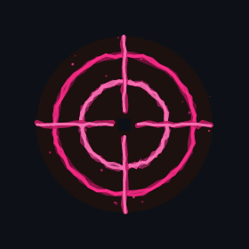
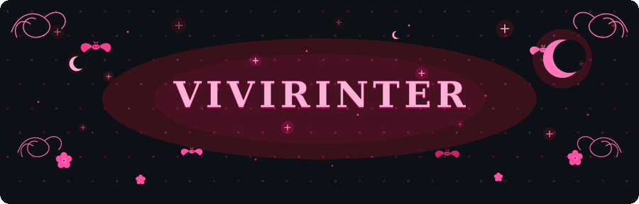
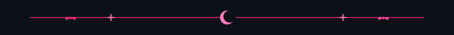
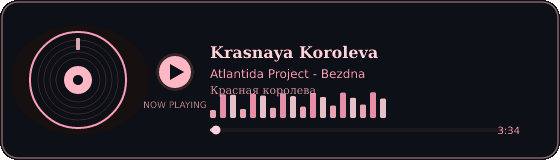

  <picture>
    <source media="(prefers-color-scheme: dark)" srcset="./assets/mark-dark.gif" />
    <source media="(prefers-color-scheme: light)" srcset="./assets/mark-light.gif" />
    
  </picture>

  <picture>
    <source media="(prefers-color-scheme: dark)" srcset="./assets/header-dark.gif" />
    <source media="(prefers-color-scheme: light)" srcset="./assets/header-light.gif" />
    
  </picture>

  <picture>
    <source media="(prefers-color-scheme: dark)" srcset="https://readme-typing-svg.demolab.com?font=Georgia&weight=600&size=22&duration=3400&pause=1100&color=FFB7C5&center=true&vCenter=true&width=780&height=46&lines=vivirinter;DevSecOps+%C2%B7+Platform+%C2%B7+AI;Kubernetes+%C2%B7+Security+%C2%B7+Go;SDR+%C2%B7+observability+%C2%B7+automation" />
    <source media="(prefers-color-scheme: light)" srcset="https://readme-typing-svg.demolab.com?font=Georgia&weight=600&size=22&duration=3400&pause=1100&color=C2185B&center=true&vCenter=true&width=780&height=46&lines=vivirinter;DevSecOps+%C2%B7+Platform+%C2%B7+AI;Kubernetes+%C2%B7+Security+%C2%B7+Go;SDR+%C2%B7+observability+%C2%B7+automation" />
    
  </picture>

  <picture>
    <source media="(prefers-color-scheme: dark)" srcset="./assets/eyes-dark.gif" />
    <source media="(prefers-color-scheme: light)" srcset="./assets/eyes-light.gif" />
    
  </picture>

  <picture>
    <source media="(prefers-color-scheme: dark)" srcset="./assets/divider-dark.png" />
    <source media="(prefers-color-scheme: light)" srcset="./assets/divider-light.png" />
    
  </picture>

<pre align="center">
╭──────────────── session ────────────────╮
│  🦇  user      vivirinter               │
│  ☾   role      DevSecOps                │
│  ✦   mood      pastel pink / black      │
│  ♡   focus     K8s · Security · AI      │
│  ❀   craft     Go · C · Python · Bash   │
╰─────────────────────────────────────────╯
</pre>

  <picture>
    <source media="(prefers-color-scheme: dark)" srcset="https://img.shields.io/badge/Platform-Kubernetes%20%C2%B7%20OpenShift%20%C2%B7%20Helm%20%C2%B7%20Argo-0D1117?style=for-the-badge&labelColor=0D1117&color=FFB7C5" />
    <source media="(prefers-color-scheme: light)" srcset="https://img.shields.io/badge/Platform-Kubernetes%20%C2%B7%20OpenShift%20%C2%B7%20Helm%20%C2%B7%20Argo-F6F8FA?style=for-the-badge&labelColor=F6F8FA&color=C2185B" />
    
  </picture>
  <picture>
    <source media="(prefers-color-scheme: dark)" srcset="https://img.shields.io/badge/CI%2FCD-GitHub%20Actions%20%C2%B7%20GitLab%20CI%20%C2%B7%20Jenkins%20%C2%B7%20Argo%20CD-0D1117?style=for-the-badge&labelColor=0D1117&color=FF9EBB" />
    <source media="(prefers-color-scheme: light)" srcset="https://img.shields.io/badge/CI%2FCD-GitHub%20Actions%20%C2%B7%20GitLab%20CI%20%C2%B7%20Jenkins%20%C2%B7%20Argo%20CD-F6F8FA?style=for-the-badge&labelColor=F6F8FA&color=AD1457" />
    
  </picture>
  <picture>
    <source media="(prefers-color-scheme: dark)" srcset="https://img.shields.io/badge/Security-Vault%20%C2%B7%20RBAC%20%C2%B7%20Hardening-0D1117?style=for-the-badge&labelColor=0D1117&color=FFD6E0" />
    <source media="(prefers-color-scheme: light)" srcset="https://img.shields.io/badge/Security-Vault%20%C2%B7%20RBAC%20%C2%B7%20Hardening-F6F8FA?style=for-the-badge&labelColor=F6F8FA&color=880E4F" />
    
  </picture>
  <picture>
    <source media="(prefers-color-scheme: dark)" srcset="https://img.shields.io/badge/Signal-RTL--SDR%20%C2%B7%20FFT%20%C2%B7%20Spectrum-0D1117?style=for-the-badge&labelColor=0D1117&color=FFB7C5" />
    <source media="(prefers-color-scheme: light)" srcset="https://img.shields.io/badge/Signal-RTL--SDR%20%C2%B7%20FFT%20%C2%B7%20Spectrum-F6F8FA?style=for-the-badge&labelColor=F6F8FA&color=C2185B" />
    
  </picture>
  <picture>
    <source media="(prefers-color-scheme: dark)" srcset="https://img.shields.io/badge/AI-Agents%20%C2%B7%20LLMs%20%C2%B7%20Copilots%20%C2%B7%20Spells-0D1117?style=for-the-badge&labelColor=0D1117&color=FF9EBB" />
    <source media="(prefers-color-scheme: light)" srcset="https://img.shields.io/badge/AI-Agents%20%C2%B7%20LLMs%20%C2%B7%20Copilots%20%C2%B7%20Spells-F6F8FA?style=for-the-badge&labelColor=F6F8FA&color=AD1457" />
    
  </picture>

  <a href="https://www.youtube.com/watch?v=QVl9G5jn7Fs">
    <picture>
      <source media="(prefers-color-scheme: dark)" srcset="./assets/now-playing-dark.gif" />
      <source media="(prefers-color-scheme: light)" srcset="./assets/now-playing-light.gif" />
      
    </picture>
  </a>

  <i>„Biednemu zawsze wiatr w oczy.”</i>

  <picture>
    <source media="(prefers-color-scheme: dark)" srcset="https://ghrs.vercel.app/api?username=vivirinter&show_icons=true&hide_border=true&bg_color=0D1117&title_color=FFB7C5&icon_color=FF9EBB&text_color=FFD6E0&include_all_commits=true&count_private=true" />
    <source media="(prefers-color-scheme: light)" srcset="https://ghrs.vercel.app/api?username=vivirinter&show_icons=true&hide_border=true&bg_color=F6F8FA&title_color=C2185B&icon_color=AD1457&text_color=4A1528&include_all_commits=true&count_private=true" />
    
  </picture>
  <picture>
    <source media="(prefers-color-scheme: dark)" srcset="https://ghrs.vercel.app/api/top-langs/?username=vivirinter&layout=compact&hide_border=true&bg_color=0D1117&title_color=FFB7C5&text_color=FFD6E0" />
    <source media="(prefers-color-scheme: light)" srcset="https://ghrs.vercel.app/api/top-langs/?username=vivirinter&layout=compact&hide_border=true&bg_color=F6F8FA&title_color=C2185B&text_color=4A1528" />
    
  </picture>

